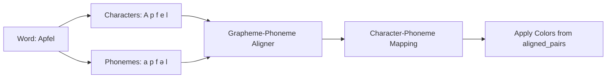

# Fix Text Coloring Algorithm for Phoneme Visualization

## Problem Analysis

The current text coloring algorithm in [`modules/visualization.py`](modules/visualization.py) has a fundamental flaw in how it maps phoneme colors to text characters.

### Current Algorithm (Lines 354-375)

The algorithm uses **linear interpolation**:

```python
phonemes_per_char = num_phonemes / num_chars
ph_idx = min(int(alnum_idx * phonemes_per_char), num_phonemes - 1)
```

This distributes phonemes evenly across characters, which doesn't match German orthography.

### Example of the Problem

**Example 1: "Grundlagenstreit"**

- **Text**: `G-r-u-n-d-l-a-g-e-n-s-t-r-e-i-t` (16 characters)
- **Expected phonemes**: `ɡɾʊndlɑːɡɛnstɾaɪt`
- **Recognized phonemes**: `ɡɾʊndlɑːɡənstɾaɪt`
- **Actual difference**: `ɛ≠ə` at phoneme index ~8

But linear algorithm incorrectly colors 'l' and 't' red.

**Example 2: "Ich habe einen Apfel"** (from screenshot)

- Expected phonemes: `ɪçhaːbəaenənənapfəl`
- Current coloring shows red on wrong characters ('a' in 'habe', 'e' in 'einen')

### Root Cause

The `expected_phonemes_dict` from [`modules/g2p_module.py`](modules/g2p_module.py) contains:

- `text_char`: entire word (e.g., "Grundlagenstreit")
- `phoneme`: single phoneme
- `position`: word start position

**There's no character-level mapping** - each phoneme is associated with the entire word, not specific letters.

## User Requirements (Confirmed)

✅ **Character-level precision required** - Must show exact characters with mismatched phonemes

❌ **Word-level coloring NOT acceptable** - Too imprecise

❌ **No special handling for compounds/loanwords** - Treat all words uniformly

✅ **Use DSL transcription + G2P** - Available in expected_phonemes_dict, can apply G2P to find character-phoneme mapping

✅ **Performance: < 3 seconds acceptable** - Alignment cost is acceptable

✅ **Test data available** - Screenshot shows "Ich habe einen Apfel" example

## Implementation Strategy

### Algorithm: Character-Level Grapheme-Phoneme Alignment



### Step-by-Step Implementation

#### Step 1: Create Grapheme-Phoneme Aligner

**New function in [`modules/visualization.py`](modules/visualization.py):**

```python
def align_graphemes_to_phonemes(
    word: str, 
    phonemes: List[str],
    use_g2p: bool = True
) -> List[Tuple[str, int]]:
    """
    Align characters in word to their corresponding phonemes.
    
    Args:
        word: German word (e.g., "Apfel")
        phonemes: List of phonemes for this word (e.g., ['a', 'p', 'f', 'ə', 'l'])
        use_g2p: Use G2P to help with alignment
        
    Returns:
        List of (character(s), phoneme_index) tuples
        Example: [('A', 0), ('p', 1), ('f', 2), ('e', 3), ('l', 4)]
    """
```

**Alignment algorithm:**

1. Convert word to lowercase for matching
2. Detect common German digraphs/trigraphs: ch, sch, ie, ei, eu, au, äu, etc.
3. Use edit distance to align character sequences with phoneme sequences
4. Optionally use G2P as reference to validate alignment
5. Return character→phoneme_index mapping

#### Step 2: Modify `create_colored_text()` Function

**Replace lines 302-391** with new logic:

```python
# For each token, align characters to phonemes
for token_info in tokens_with_positions:
    token = token_info['token']
    token_phonemes = phonemes_by_token.get(token_clean, [])
    
    if token_phonemes:
        # NEW: Use grapheme-phoneme alignment instead of linear interpolation
        phoneme_list = [ph['phoneme'] for ph in token_phonemes]
        char_to_phoneme_idx = align_graphemes_to_phonemes(token, phoneme_list)
        
        # Map each character to its phoneme color
        for char_idx, (char_str, ph_idx) in enumerate(char_to_phoneme_idx):
            char_pos_in_text = token_start + char_idx
            collapsed_ph_idx = token_phonemes[ph_idx]['index']
            
            if collapsed_ph_idx in collapsed_ph_to_color:
                # Apply color for all characters in this grapheme
                for i in range(len(char_str)):
                    char_to_color[char_pos_in_text + i] = collapsed_ph_to_color[collapsed_ph_idx]
```

#### Step 3: Test with Examples

**Test Case 1: "Ich habe einen Apfel"**

- Expected: `ɪçhaːbəaenənənapfəl`
- Verify correct character coloring:
  - "Ich" → `ɪç` maps to I→ɪ, ch→ç
  - "habe" → `haːbə` maps to h→h, a→aː, b→b, e→ə
  - "einen" → `aenən` maps correctly
  - "Apfel" → `apfəl` maps correctly

**Test Case 2: "Grundlagenstreit"**

- Verify 'l' and 't' are NOT red when mismatch is in 'ɛ' vs 'ə'

#### Step 4: Fallback Logic

If alignment fails (ambiguous or error):

```python
# Fallback: color entire word with dominant color
word_colors = [collapsed_ph_to_color.get(ph['index'], 'gray') 
               for ph in token_phonemes]
dominant_color = max(set(word_colors), key=word_colors.count)
for i in range(len(token)):
    char_to_color[token_start + i] = dominant_color
```

### German Grapheme Patterns to Handle

Common multi-character graphemes in German:

- **Digraphs**: ch, ck, sch, ie, ei, eu, äu, au
- **Long vowels**: aa, ee, oo (rare but exist)
- **Consonant clusters**: ng, st, sp

### Performance Optimization

- **Pre-compute G2P mappings** for common words (cache)
- **Use simple heuristics first** before full edit distance
- **Limit edit distance computation** to words < 20 characters
- **Parallelize** if needed (unlikely for < 3s requirement)

## Files to Modify

1. [`modules/visualization.py`](modules/visualization.py):

   - Add `align_graphemes_to_phonemes()` function (~100 lines)
   - Modify `create_colored_text()` lines 302-391 (~50 lines changed)
   - Add `_detect_german_graphemes()` helper (~30 lines)

2. Optional: [`modules/g2p_module.py`](modules/g2p_module.py):

   - Add utility to get character-level G2P if needed

3. Test file (new or existing):

   - Add test cases for alignment verification

## Expected Outcome

After implementation:

- ✅ "Ich habe einen Apfel" shows correct character coloring
- ✅ "Grundlagenstreit" colors only the actual mismatched character
- ✅ Multi-character graphemes (ch, ei, etc.) handled correctly
- ✅ Performance < 3 seconds for typical sentences
- ✅ Fallback handles edge cases gracefully

## Next Steps

Ready to implement? The plan is:

1. Create `align_graphemes_to_phonemes()` function
2. Replace linear interpolation in `create_colored_text()`
3. Test with provided examples
4. Refine based on results