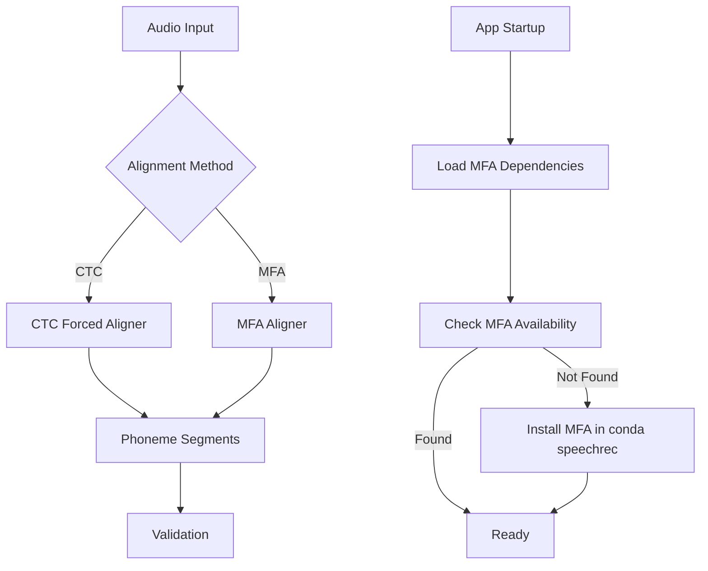

# План интеграции MFA Alignment

## Цель

Добавить MFA как параллельный вариант для forced alignment, не изменяя текущий CTC подход. Измерить latency обоих методов для оценки производительности.

## Архитектура



## Задачи

### 1. Создать модуль MFA Alignment

**Файл:** `modules/mfa_alignment.py`

- Класс `MFAAligner` аналогично `ForcedAligner`
- Метод `extract_phoneme_segments()` возвращает `List[PhonemeSegment]`
- Использует MFA через subprocess для одного аудио файла
- Парсит TextGrid результат для извлечения временных меток
- Обработка ошибок и fallback на CTC при неудаче

**Зависимости:**

- `textgrid` или `praat-textgrid` для парсинга TextGrid
- Доступ к MFA через командную строку (conda environment "speechrec")

**Структура:**

```python
class MFAAligner:
    def __init__(self, mfa_dict="german_mfa", mfa_model="german_mfa"):
        # Проверка доступности MFA
        # Инициализация путей
    
    def extract_phoneme_segments(
        self, 
        audio_path: Path, 
        text: str, 
        phonemes: List[str],
        sample_rate: int
    ) -> List[PhonemeSegment]:
        # 1. Создать временный корпус (папка с .wav и .lab)
        # 2. Запустить MFA align через subprocess
        # 3. Парсить TextGrid результат
        # 4. Конвертировать в PhonemeSegment формат
        # 5. Очистить временные файлы
```

### 2. Добавить конфигурацию MFA

**Файл:** `config.py`

Добавить настройки:

- `MFA_ENABLED = True` - включить/выключить MFA
- `MFA_DICT = "german_mfa"` - словарь MFA
- `MFA_MODEL = "german_mfa"` - акустическая модель
- `MFA_BIN_PATH = None` - путь к MFA (auto-detect из conda)
- `MFA_TEMP_DIR = PROJECT_ROOT / ".mfa_temp"` - временная папка для MFA

### 3. Добавить выбор метода alignment в интерфейс

**Файл:** `app.py`

В `create_interface()` добавить:

- Checkbox "Use MFA for alignment" (по умолчанию False - использует CTC)
- Передавать значение в `process_pronunciation()`

### 4. Интегрировать MFA в процесс обработки

**Файл:** `app.py` в функции `process_pronunciation(text, audio, use_mfa)`

**Важно:** Текст для MFA берется из параметра `text` (поле "German Text" в интерфейсе), который уже передается в функцию.

После Stage 4 (фильтрация фонем):

- Если `use_mfa=True`:
  - Использовать параметр `text` из интерфейса (не распознанный текст!)
  - Сохранить аудио во временный файл
  - Вызвать `mfa_aligner.extract_phoneme_segments(audio_path, text, phonemes, sample_rate)`
  - MFA выровняет аудио с оригинальным текстом пользователя
  - Логировать latency
- Если `use_mfa=False`:
  - Использовать текущий CTC подход (с emissions из Wav2Vec2)
  - Логировать latency

**Важно:**

- Оба метода должны возвращать одинаковый формат `List[PhonemeSegment]` для совместимости
- MFA использует оригинальный текст из интерфейса, CTC использует распознанные фонемы из модели

### 5. Добавить логирование latency

**Файл:** `app.py`

Добавить логирование в debug.log:

- `alignment_method`: "CTC" или "MFA"
- `alignment_latency_ms`: время выполнения в миллисекундах
- `segments_count`: количество найденных сегментов
- `alignment_quality`: метрики качества (если доступны)

**Формат лога:**

```json
{
  "sessionId": "debug-session",
  "runId": "performance",
  "hypothesisId": "ALIGNMENT_LATENCY",
  "location": "app.py:process_pronunciation:alignment",
  "message": "Alignment completed",
  "data": {
    "method": "MFA",
    "latency_ms": 1234,
    "segments_count": 45,
    "audio_duration_seconds": 3.5
  },
  "timestamp": 1234567890,
  "elapsed_ms": 1234
}
```

### 6. Загрузка MFA при старте приложения

**Файл:** `app.py` в функции `load_models_in_background()`

Добавить Stage 4:

- Проверить доступность MFA через `which mfa` или проверку conda environment
- Если не найден - попытаться установить через conda в environment "speechrec"
- Проверить наличие словаря и модели MFA
- Инициализировать `MFAAligner` глобально

**Код:**

```python
def load_mfa_in_background():
    """Load MFA aligner in background."""
    try:
        # Check MFA availability
        # Install if needed in conda speechrec
        # Initialize MFAAligner
        global mfa_aligner
        mfa_aligner = MFAAligner()
        print("MFA aligner loaded successfully!")
    except Exception as e:
        print(f"Warning: MFA aligner not available: {e}")
        mfa_aligner = None
```

### 7. Установка зависимостей

**Файл:** `requirements.txt`

Добавить:

- `textgrid>=1.5.0` или `praat-textgrid>=1.0.0` для парсинга TextGrid
- MFA устанавливается через conda, не через pip

**Примечание:** MFA должен быть установлен в conda environment "speechrec" через:

```bash
conda install -c conda-forge montreal-forced-alignment -n speechrec
mfa model download acoustic german_mfa
mfa model download dictionary german_mfa
```

### 8. Временные файлы

**Структура:**

- `.mfa_temp/` - временная папка для MFA (в `.gitignore`)
- Для каждого запроса создается подпапка с уникальным ID
- Очистка после обработки

## Файлы для изменения

1. **Новые файлы:**

   - `modules/mfa_alignment.py` - модуль MFA alignment

2. **Изменяемые файлы:**

   - `app.py` - интеграция MFA, добавление checkbox, логирование
   - `config.py` - настройки MFA
   - `requirements.txt` - библиотека для парсинга TextGrid
   - `.gitignore` - добавить `.mfa_temp/`

3. **Файлы из german-phoneme-validator (если нужно):**

   - Проверить наличие готовых утилит для парсинга TextGrid
   - Если есть - скопировать в текущий проект

## Критерии успеха

1. Оба метода (CTC и MFA) работают параллельно
2. Latency логируется для обоих методов
3. MFA загружается при старте приложения
4. Временные файлы MFA корректно очищаются
5. Fallback на CTC при ошибках MFA
6. Интерфейс позволяет выбирать метод alignment

## Риски и митигация

- **Риск:** MFA может быть медленнее CTC
  - **Митигация:** Логирование latency покажет реальную разницу, можно оптимизировать или использовать только для проблемных случаев

- **Риск:** MFA требует установки через conda
  - **Митигация:** Автоматическая проверка и установка при старте, fallback на CTC

- **Риск:** Парсинг TextGrid может быть сложным
  - **Митигация:** Использовать готовую библиотеку textgrid, протестировать на разных форматах