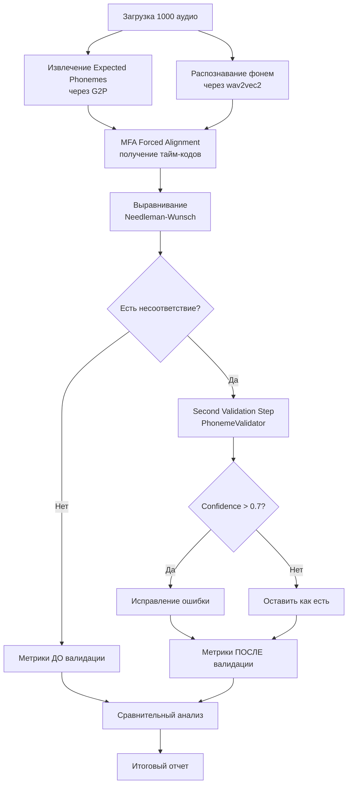

# План создания ноутбука для анализа MFA + Second Validation

## Цель

Создать аналитический ноутбук, который повторяет структуру [`deep_phoneme_mismatch_analysis.ipynb`](/Volumes/SSanDisk/SpeechRec-German-diagnostic/notebooks/deep_phoneme_mismatch_analysis.ipynb), но добавляет:

1. **MFA alignment** вместо пропорционального выравнивания
2. **Second Validation Step** через german-phoneme-validator
3. **Сравнительный анализ**: точность ДО и ПОСЛЕ валидации

## Архитектура решения



## Основные компоненты

### 1. Инициализация и загрузка данных

**Файлы для чтения:**

- [`config.py`](/Volumes/SSanDisk/SpeechRec-German-diagnostic/config.py) - конфигурация проекта
- [`data/dictionaries/metadata_wav_clean_hochdeutsch.csv`](/Volumes/SSanDisk/SpeechRec-German-diagnostic/data/dictionaries/metadata_wav_clean_hochdeutsch.csv) - метаданные

**Выборка:** 1000 записей (900 обычных + 100 с заимствованиями)

### 2. Модули для импорта

```python
# Из SpeechRec-German-diagnostic
from modules.phoneme_recognition import PhonemeRecognizer
from modules.g2p_module import get_expected_phonemes
from modules.phoneme_normalizer import get_phoneme_normalizer
from modules.alignment import needleman_wunsch_align
from modules.mfa_alignment import get_mfa_aligner, MFAConfig
from modules.metrics import calculate_per

# Из german-phoneme-validator
sys.path.insert(0, '/Volumes/SSanDisk/german-phoneme-validator')
from core.validator import PhonemeValidator
```

### 3. Pipeline обработки (аналогично app.py:806-900)

**Этап 1: Базовое распознавание**

- Извлечение expected phonemes через G2P
- Распознавание recognized phonemes через wav2vec2
- Сохранение baseline результатов

**Этап 2: MFA Alignment**

```python
mfa_config = MFAConfig(
    mfa_dict="german_mfa",
    mfa_model="german_mfa",
    mfa_bin_path="/Volumes/SSanDisk/SpeechRec-German/miniforge/envs/mfa310/bin/mfa"
)
mfa_aligner = get_mfa_aligner(mfa_config)

# Для каждого аудио
recognized_segments = mfa_aligner.extract_phoneme_segments(
    audio_path,
    text,
    expected_phonemes,
    sample_rate=16000
)
```

**Этап 3: Выравнивание и метрики ДО валидации**

- Needleman-Wunsch alignment
- Расчет PER, accuracy, confusion matrix
- Сохранение `aligned_pairs_before_validation`

**Этап 4: Second Validation Step**

```python
validator = PhonemeValidator(
    artifacts_dir=Path('/Volumes/SSanDisk/german-phoneme-validator/artifacts')
)

for i, (expected_ph, recognized_ph) in enumerate(aligned_pairs):
    # Пропускаем совпадения
    if expected_ph == recognized_ph:
        continue
    
    # Проверяем наличие модели
    if not validator.has_trained_model(expected_ph, recognized_ph):
        continue
    
    # Извлекаем аудио сегмент по тайм-кодам из MFA
    segment = recognized_segments[segment_index]
    start_sample = int(segment.start_time * 16000)
    end_sample = int(segment.end_time * 16000)
    audio_segment = waveform[start_sample:end_sample]
    
    # Валидация
    phoneme_pair = validator.get_phoneme_pair(expected_ph, recognized_ph)
    result = validator.validate_phoneme_segment(
        audio_segment,
        phoneme_pair=phoneme_pair,
        expected_phoneme=expected_ph,
        suspected_phoneme=recognized_ph,
        sr=16000
    )
    
    # Если уверенность > 0.7, исправляем
    if result['is_correct'] and result['confidence'] > 0.7:
        aligned_pairs[i] = (expected_ph, expected_ph)
        validation_corrected_count += 1
```

**Этап 5: Метрики ПОСЛЕ валидации**

- Расчет PER, accuracy после исправлений
- Сравнение с baseline

### 4. Структура отчета

**Сравнительная таблица:**

| Метрика | ДО валидации | ПОСЛЕ валидации | Улучшение |

|---------|--------------|-----------------|-----------|

| PER (%) | X.XX | Y.YY | ΔZ.ZZ |

| Accuracy (%) | X.XX | Y.YY | ΔZ.ZZ |

| Исправленных ошибок | - | N | - |

| Проверенных пар | - | M | - |

**Детальный анализ по парам:**

- Топ-10 пар фонем, где валидация помогла больше всего
- Confusion matrix ДО и ПОСЛЕ
- Примеры успешных исправлений

### 5. Ключевые различия с original notebook

| Аспект | Original | Новый ноутбук |

|--------|----------|---------------|

| Alignment | Proportional | **MFA (Montreal Forced Aligner)** |

| Тайм-коды | Оценочные | **Точные от MFA** |

| Валидация | Нет | **Second Validation Step** |

| Сравнение | Только baseline | **ДО vs ПОСЛЕ** |

| Фокус | Анализ ошибок | **Улучшение через валидацию** |

## Файловая структура

**Новый ноутбук:**

```
notebooks/mfa_validation_phoneme_analysis.ipynb
```

**Выходные файлы:**

- `phoneme_analysis_validation_comparison.csv` - детальные результаты
- `validation_improvements_summary.json` - суммарная статистика
- Графики улучшений по парам фонем

## Технические детали

### Обработка тайм-кодов из MFA

```python
# MFA возвращает PhonemeSegment с точными границами
segment = PhonemeSegment(
    label='b',
    start_time=0.45,  # секунды
    end_time=0.52,
    score=1.0,
    frame_start=22,  # фреймы
    frame_end=26
)

# Извлечение аудио
start_sample = int(segment.start_time * 16000)
end_sample = int(segment.end_time * 16000)
audio_segment = waveform[start_sample:end_sample]
```

### Обработка коротких сегментов

Если сегмент < 100 samples (~6ms), используется контекстное окно:

```python
MIN_SEGMENT_LENGTH = 100
CONTEXT_MS = 100.0

if len(audio_segment) < MIN_SEGMENT_LENGTH:
    context_samples = int(CONTEXT_MS / 1000 * 16000)
    center_sample = int(segment.start_time * 16000)
    audio_segment = waveform[center_sample-context_samples//2 : center_sample+context_samples//2]
```

### Порог уверенности

- **Confidence > 0.7** - исправляем ошибку
- **Confidence ≤ 0.7** - сохраняем результат, но логируем

## Ожидаемые результаты

1. **Количественная оценка** улучшения точности через Second Validation
2. **Идентификация пар фонем**, где валидация наиболее эффективна
3. **Визуализация** до/после через confusion matrices
4. **Статистика** по confidence распределению

## Зависимости

**Python packages:**

- `torch`, `torchaudio` - для wav2vec2
- `librosa` - обработка аудио
- `pandas`, `numpy` - анализ данных
- `matplotlib`, `seaborn` - визуализация
- `textgrid` - парсинг MFA результатов

**Внешние инструменты:**

- MFA binary: `/Volumes/SSanDisk/SpeechRec-German/miniforge/envs/mfa310/bin/mfa`
- Trained models: `/Volumes/SSanDisk/german-phoneme-validator/artifacts/`

## Детальная структура ноутбука

### Ячейка 0: Configuration

```python
ANALYSIS_STAGE = 1  # Для разных запусков
RANDOM_SEED = ANALYSIS_STAGE * 100
STAGE_SUFFIX = f"_stage{ANALYSIS_STAGE}"

# MFA configuration
MFA_BIN = "/Volumes/SSanDisk/SpeechRec-German/miniforge/envs/mfa310/bin/mfa"
MFA_DICT = "german_mfa"
MFA_MODEL = "german_mfa"

# Validation configuration
VALIDATION_CONFIDENCE_THRESHOLD = 0.7
VALIDATOR_ARTIFACTS_DIR = Path("/Volumes/SSanDisk/german-phoneme-validator/artifacts")
```

### Ячейка 1: Setup and Imports

```python
import sys
from pathlib import Path
import warnings
warnings.filterwarnings('ignore')

# Project paths
notebook_dir = Path.cwd()
project_root = notebook_dir.parent
sys.path.insert(0, str(project_root))

# Add german-phoneme-validator to path
validator_project = project_root.parent / "german-phoneme-validator"
sys.path.insert(0, str(validator_project))

# Standard libraries
import pandas as pd
import numpy as np
import matplotlib.pyplot as plt
import seaborn as sns
from collections import Counter, defaultdict
from tqdm.auto import tqdm
import json
import librosa
import torch

# Project modules
from modules.phoneme_recognition import PhonemeRecognizer
from modules.g2p_module import get_expected_phonemes
from modules.phoneme_normalizer import get_phoneme_normalizer
from modules.alignment import needleman_wunsch_align
from modules.mfa_alignment import get_mfa_aligner, MFAConfig
from modules.metrics import calculate_per
from modules.forced_alignment import PhonemeSegment

# Validator module
from core.validator import PhonemeValidator, get_validator
```

### Ячейка 2: Load Metadata and Sample Selection

Повторяет логику из исходного ноутбука:

- Загрузка CSV метаданных
- Фильтрация по TV-2021.02-Neutral
- Определение loanwords
- Выборка 900 + 100 записей
- Проверка существования аудио файлов

### Ячейка 3: Initialize Models

```python
# PhonemeRecognizer
recognizer = PhonemeRecognizer()

# PhonemeNormalizer
normalizer = get_phoneme_normalizer()

# MFA Aligner
mfa_config = MFAConfig(
    mfa_dict=MFA_DICT,
    mfa_model=MFA_MODEL,
    mfa_bin_path=MFA_BIN
)
mfa_aligner = get_mfa_aligner(mfa_config)

# PhonemeValidator
validator = get_validator(artifacts_dir=VALIDATOR_ARTIFACTS_DIR)
available_pairs = validator.get_available_pairs()
print(f"Available phoneme pairs for validation: {len(available_pairs)}")
```

### Ячейка 4: Extract Phonemes and MFA Alignment

**Ключевое отличие:** Добавляется MFA alignment для получения точных тайм-кодов

```python
def extract_phonemes_with_mfa(row):
    """
    Extract phonemes and perform MFA alignment for precise timing.
    
    Returns:
        dict with expected_phonemes, recognized_phonemes, 
        recognized_segments (from MFA), waveform
    """
    result = {
        'expected_phonemes': [],
        'recognized_phonemes': [],
        'recognized_segments': [],
        'waveform': None,
        'error': None
    }
    
    try:
        # 1. Extract expected phonemes from text
        text = row['text']
        expected_dict = get_expected_phonemes(text)
        expected_phonemes = [p.get('phoneme', '') for p in expected_dict if p.get('phoneme')]
        
        # 2. Load audio
        audio_path = Path(row['audio_path_fixed'])
        waveform, sr = librosa.load(str(audio_path), sr=16000, mono=True)
        result['waveform'] = waveform
        
        # 3. Recognize phonemes from audio (wav2vec2)
        logits, _ = recognizer.recognize_phonemes(str(audio_path))
        recognized_str = recognizer.decode_phonemes(logits)
        recognized_phonemes = recognized_str.split()
        
        # 4. MFA Alignment - KEY ADDITION
        recognized_segments = mfa_aligner.extract_phoneme_segments(
            audio_path,
            text.strip(),
            expected_phonemes,
            sample_rate=16000
        )
        
        result['expected_phonemes'] = expected_phonemes
        result['recognized_phonemes'] = recognized_phonemes
        result['recognized_segments'] = recognized_segments
        
    except Exception as e:
        result['error'] = str(e)
        import traceback
        traceback.print_exc()
    
    return result

# Process all records with progress bar
results = []
for idx, row in tqdm(df_sample.iterrows(), total=len(df_sample), desc="Extracting phonemes + MFA"):
    result = extract_phonemes_with_mfa(row)
    results.append(result)

# Add to dataframe
df_sample['expected_phonemes'] = [r['expected_phonemes'] for r in results]
df_sample['recognized_phonemes'] = [r['recognized_phonemes'] for r in results]
df_sample['recognized_segments'] = [r['recognized_segments'] for r in results]
df_sample['waveform'] = [r['waveform'] for r in results]
df_sample['processing_error'] = [r['error'] for r in results]
```

### Ячейка 5: Alignment and Metrics BEFORE Validation

```python
def align_and_calculate_metrics(expected, recognized):
    """
    Align phonemes and calculate baseline metrics.
    Returns: aligned_pairs, per, accuracy, match_count
    """
    # Needleman-Wunsch alignment
    aligned_pairs, alignment_score = needleman_wunsch_align(
        expected,
        recognized,
        use_similarity_matrix=True
    )
    
    # Calculate PER
    per = calculate_per_from_alignment(aligned_pairs)
    
    # Calculate accuracy
    match_count = sum(1 for exp, rec in aligned_pairs if exp == rec and exp is not None)
    total_count = sum(1 for exp, rec in aligned_pairs if exp is not None or rec is not None)
    accuracy = match_count / total_count if total_count > 0 else 0.0
    
    return aligned_pairs, per, accuracy, match_count

# Process all records
baseline_results = []
for idx, row in tqdm(df_sample.iterrows(), total=len(df_sample), desc="Calculating baseline metrics"):
    expected = row['expected_phonemes']
    recognized = row['recognized_phonemes']
    
    aligned_pairs, per, accuracy, match_count = align_and_calculate_metrics(expected, recognized)
    
    baseline_results.append({
        'aligned_pairs': aligned_pairs,
        'per': per,
        'accuracy': accuracy,
        'match_count': match_count
    })

# Add to dataframe
df_sample['aligned_pairs_before'] = [r['aligned_pairs'] for r in baseline_results]
df_sample['per_before'] = [r['per'] for r in baseline_results]
df_sample['accuracy_before'] = [r['accuracy'] for r in baseline_results]
df_sample['match_count_before'] = [r['match_count'] for r in baseline_results]

# Summary statistics
print(f"Baseline PER: {df_sample['per_before'].mean():.2%}")
print(f"Baseline Accuracy: {df_sample['accuracy_before'].mean():.2%}")
```

### Ячейка 6: Second Validation Step

**Ключевая ячейка** - применение валидации аналогично app.py:806-900

```python
def apply_validation_step(row):
    """
    Apply Second Validation Step for mismatches.
    Returns: aligned_pairs_after, validation_stats
    """
    aligned_pairs = row['aligned_pairs_before'].copy()
    recognized_segments = row['recognized_segments']
    waveform = row['waveform']
    
    stats = {
        'validated_count': 0,
        'corrected_count': 0,
        'validation_results': []
    }
    
    segment_index = 0
    
    for i, (expected_ph, recognized_ph) in enumerate(aligned_pairs):
        # Skip matches, None, or word boundaries
        if expected_ph == recognized_ph or expected_ph is None or recognized_ph is None:
            if recognized_ph is not None and recognized_ph != '||':
                segment_index += 1
            continue
        
        if expected_ph == '||' or recognized_ph == '||':
            continue
        
        # Check if model exists for this pair
        if not validator.has_trained_model(expected_ph, recognized_ph):
            if recognized_ph is not None:
                segment_index += 1
            continue
        
        # Get phoneme pair name
        phoneme_pair = validator.get_phoneme_pair(expected_ph, recognized_ph)
        if phoneme_pair is None:
            segment_index += 1
            continue
        
        # Find corresponding segment
        segment = None
        if segment_index < len(recognized_segments):
            segment = recognized_segments[segment_index]
        
        if segment is None:
            segment_index += 1
            continue
        
        # Extract audio segment
        MIN_SEGMENT_LENGTH = 100
        CONTEXT_MS = 100.0
        
        start_sample = int(segment.start_time * 16000)
        end_sample = int(segment.end_time * 16000)
        audio_segment = waveform[start_sample:end_sample]
        
        # Handle short segments with context window
        if len(audio_segment) < MIN_SEGMENT_LENGTH:
            center_time = segment.start_time if segment.start_time > 0 else (
                segment_index / len(recognized_segments) * (len(waveform) / 16000)
            )
            context_samples = int(CONTEXT_MS / 1000 * 16000)
            half_context = context_samples // 2
            center_sample = int(center_time * 16000)
            
            fallback_start = max(0, center_sample - half_context)
            fallback_end = min(len(waveform), center_sample + half_context)
            audio_segment = waveform[fallback_start:fallback_end]
        
        # Validate
        validation_result = validator.validate_phoneme_segment(
            audio_segment,
            phoneme_pair=phoneme_pair,
            expected_phoneme=expected_ph,
            suspected_phoneme=recognized_ph,
            sr=16000
        )
        
        stats['validated_count'] += 1
        stats['validation_results'].append({
            'index': i,
            'expected': expected_ph,
            'recognized': recognized_ph,
            'pair': phoneme_pair,
            'result': validation_result
        })
        
        # Check if correction needed
        is_correct = validation_result.get('is_correct', False)
        confidence = validation_result.get('confidence', 0.0)
        
        if is_correct and confidence > VALIDATION_CONFIDENCE_THRESHOLD:
            # Correct the error
            aligned_pairs[i] = (expected_ph, expected_ph)
            stats['corrected_count'] += 1
        
        segment_index += 1
    
    return aligned_pairs, stats

# Apply validation to all records
validation_results = []
for idx, row in tqdm(df_sample.iterrows(), total=len(df_sample), desc="Applying validation"):
    aligned_pairs_after, stats = apply_validation_step(row)
    validation_results.append({
        'aligned_pairs_after': aligned_pairs_after,
        'validation_stats': stats
    })

# Add to dataframe
df_sample['aligned_pairs_after'] = [r['aligned_pairs_after'] for r in validation_results]
df_sample['validation_stats'] = [r['validation_stats'] for r in validation_results]
```

### Ячейка 7: Metrics AFTER Validation

```python
# Calculate metrics after validation
after_results = []
for idx, row in df_sample.iterrows():
    aligned_pairs = row['aligned_pairs_after']
    
    per = calculate_per_from_alignment(aligned_pairs)
    match_count = sum(1 for exp, rec in aligned_pairs if exp == rec and exp is not None)
    total_count = sum(1 for exp, rec in aligned_pairs if exp is not None or rec is not None)
    accuracy = match_count / total_count if total_count > 0 else 0.0
    
    after_results.append({
        'per': per,
        'accuracy': accuracy,
        'match_count': match_count
    })

df_sample['per_after'] = [r['per'] for r in after_results]
df_sample['accuracy_after'] = [r['accuracy'] for r in after_results]
df_sample['match_count_after'] = [r['match_count'] for r in after_results]

# Calculate improvements
df_sample['per_improvement'] = df_sample['per_before'] - df_sample['per_after']
df_sample['accuracy_improvement'] = df_sample['accuracy_after'] - df_sample['accuracy_before']

# Summary
print("="*60)
print("COMPARISON: BEFORE vs AFTER VALIDATION")
print("="*60)
print(f"PER Before:  {df_sample['per_before'].mean():.2%}")
print(f"PER After:   {df_sample['per_after'].mean():.2%}")
print(f"PER Improvement: {df_sample['per_improvement'].mean():.2%}")
print()
print(f"Accuracy Before:  {df_sample['accuracy_before'].mean():.2%}")
print(f"Accuracy After:   {df_sample['accuracy_after'].mean():.2%}")
print(f"Accuracy Improvement: {df_sample['accuracy_improvement'].mean():.2%}")
print()
total_validated = sum(s['validated_count'] for s in df_sample['validation_stats'])
total_corrected = sum(s['corrected_count'] for s in df_sample['validation_stats'])
print(f"Total validated pairs: {total_validated}")
print(f"Total corrected errors: {total_corrected}")
print(f"Correction rate: {total_corrected/total_validated*100:.1f}%" if total_validated > 0 else "N/A")
print("="*60)
```

### Ячейка 8: Detailed Analysis by Phoneme Pairs

```python
# Collect all validation results
all_validation_data = []
for idx, row in df_sample.iterrows():
    stats = row['validation_stats']
    for val_result in stats['validation_results']:
        all_validation_data.append({
            'phoneme_pair': val_result['pair'],
            'expected': val_result['expected'],
            'recognized': val_result['recognized'],
            'is_correct': val_result['result'].get('is_correct'),
            'confidence': val_result['result'].get('confidence', 0.0),
            'was_corrected': val_result['result'].get('is_correct') and 
                           val_result['result'].get('confidence', 0.0) > VALIDATION_CONFIDENCE_THRESHOLD
        })

df_validation = pd.DataFrame(all_validation_data)

# Top pairs by correction count
top_corrected_pairs = df_validation[df_validation['was_corrected']].groupby('phoneme_pair').size().sort_values(ascending=False)
print("Top 10 phoneme pairs by corrections:")
print(top_corrected_pairs.head(10))

# Average confidence by pair
avg_confidence = df_validation.groupby('phoneme_pair')['confidence'].mean().sort_values(ascending=False)
print("\nTop 10 pairs by average confidence:")
print(avg_confidence.head(10))
```

### Ячейка 9: Visualization

```python
# Comparison plots
fig, axes = plt.subplots(2, 2, figsize=(15, 12))

# PER distribution before/after
axes[0, 0].hist(df_sample['per_before'], bins=50, alpha=0.5, label='Before', color='red')
axes[0, 0].hist(df_sample['per_after'], bins=50, alpha=0.5, label='After', color='green')
axes[0, 0].set_xlabel('PER')
axes[0, 0].set_ylabel('Frequency')
axes[0, 0].set_title('PER Distribution: Before vs After Validation')
axes[0, 0].legend()
axes[0, 0].grid(True, alpha=0.3)

# Accuracy distribution
axes[0, 1].hist(df_sample['accuracy_before'], bins=50, alpha=0.5, label='Before', color='red')
axes[0, 1].hist(df_sample['accuracy_after'], bins=50, alpha=0.5, label='After', color='green')
axes[0, 1].set_xlabel('Accuracy')
axes[0, 1].set_ylabel('Frequency')
axes[0, 1].set_title('Accuracy Distribution: Before vs After Validation')
axes[0, 1].legend()
axes[0, 1].grid(True, alpha=0.3)

# Improvement scatter
axes[1, 0].scatter(df_sample['per_before'], df_sample['per_after'], alpha=0.5)
axes[1, 0].plot([0, 1], [0, 1], 'r--', label='No improvement')
axes[1, 0].set_xlabel('PER Before')
axes[1, 0].set_ylabel('PER After')
axes[1, 0].set_title('PER Improvement Scatter')
axes[1, 0].legend()
axes[1, 0].grid(True, alpha=0.3)

# Top corrected pairs bar chart
top_10_pairs = top_corrected_pairs.head(10)
axes[1, 1].barh(range(len(top_10_pairs)), top_10_pairs.values)
axes[1, 1].set_yticks(range(len(top_10_pairs)))
axes[1, 1].set_yticklabels(top_10_pairs.index)
axes[1, 1].set_xlabel('Number of Corrections')
axes[1, 1].set_title('Top 10 Phoneme Pairs by Corrections')
axes[1, 1].grid(True, alpha=0.3, axis='x')

plt.tight_layout()
plt.savefig(project_root / 'data' / f'validation_comparison{STAGE_SUFFIX}.png', dpi=150, bbox_inches='tight')
plt.show()
```

### Ячейка 10: Export Results

```python
# Save detailed results
output_file = project_root / 'data' / f'phoneme_analysis_validation_comparison{STAGE_SUFFIX}.csv'

# Prepare export dataframe
export_df = df_sample[[
    'text', 'has_loanword', 'durationSeconds',
    'per_before', 'per_after', 'per_improvement',
    'accuracy_before', 'accuracy_after', 'accuracy_improvement',
    'match_count_before', 'match_count_after'
]].copy()

# Add validation summary
export_df['validated_pairs'] = df_sample['validation_stats'].apply(lambda s: s['validated_count'])
export_df['corrected_errors'] = df_sample['validation_stats'].apply(lambda s: s['corrected_count'])

export_df.to_csv(output_file, index=False)
print(f"Results saved to: {output_file}")

# Save summary statistics
summary = {
    'total_records': len(df_sample),
    'per_before_mean': float(df_sample['per_before'].mean()),
    'per_after_mean': float(df_sample['per_after'].mean()),
    'per_improvement_mean': float(df_sample['per_improvement'].mean()),
    'accuracy_before_mean': float(df_sample['accuracy_before'].mean()),
    'accuracy_after_mean': float(df_sample['accuracy_after'].mean()),
    'accuracy_improvement_mean': float(df_sample['accuracy_improvement'].mean()),
    'total_validated_pairs': int(total_validated),
    'total_corrected_errors': int(total_corrected),
    'correction_rate': float(total_corrected/total_validated) if total_validated > 0 else 0.0
}

summary_file = project_root / 'data' / f'validation_summary{STAGE_SUFFIX}.json'
with open(summary_file, 'w') as f:
    json.dump(summary, f, indent=2)
print(f"Summary saved to: {summary_file}")
```

## Критические моменты реализации

### 1. Синхронизация индексов сегментов

При итерации по `aligned_pairs` нужно правильно отслеживать `segment_index` для соответствия с `recognized_segments` из MFA. Логика из app.py:816-818:

```python
# Advance segment index only for recognized phonemes (not None, not word boundary)
if recognized_ph is not None and recognized_ph != '||':
    segment_index += 1
```

### 2. Обработка несоответствий длин

MFA может вернуть другое количество сегментов, чем recognized_phonemes из wav2vec2. Нужна проверка границ:

```python
if segment_index < len(recognized_segments):
    segment = recognized_segments[segment_index]
else:
    # Fallback: skip validation for this mismatch
    continue
```

### 3. Monkey-patch для feature extraction

Как в `modules/phoneme_validator.py:57-82`, нужно применить патч для удаления `vot_category`:

```python
from core import feature_extraction
original_extract_vot = feature_extraction.extract_vot

def patched_extract_vot(audio, sr=16000):
    result = original_extract_vot(audio, sr)
    if 'vot_category' in result:
        del result['vot_category']
    return result

feature_extraction.extract_vot = patched_extract_vot
```

### 4. Производительность

MFA alignment медленный (~1-3 сек на файл). Рекомендуется:

- Использовать кэш MFA (уже реализован в `mfa_alignment.py`)
- Обрабатывать батчами с сохранением промежуточных результатов
- Добавить checkpoint для возможности прервать и продолжить

## Ожидаемое время выполнения

- Загрузка данных: ~1 минута
- Извлечение фонем + MFA alignment: ~30-60 минут (1000 файлов)
- Выравнивание и метрики: ~5 минут
- Валидация: ~15-30 минут (только несоответствия)
- Анализ и визуализация: ~2 минуты

**Итого: ~1-2 часа** для полного прогона на 1000 записей