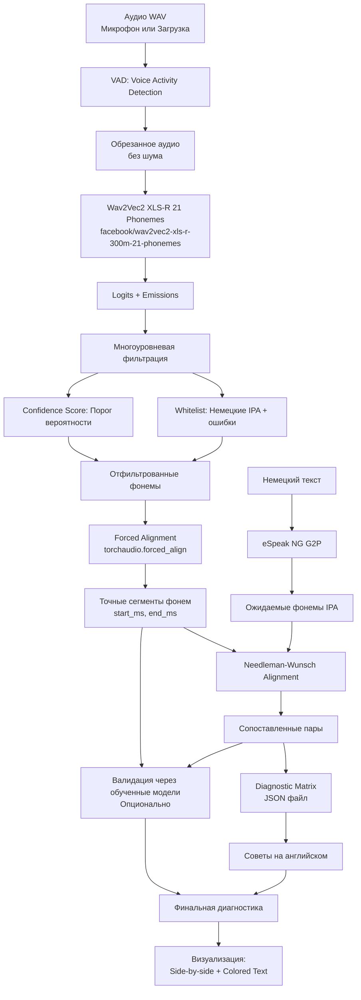

# План разра

ботки: German Pronunciation Diagnostic App (L2-Trainer)

## Обзор

Создание нового диагностического приложения для обучения произношению немецкого языка (L2-Trainer) в отдельной директории. Приложение сравнивает эталонные фонемы (Gold Standard) с реально распознанными фонемами и предоставляет детальную диагностику с советами по улучшению произношения.

## Архитектура системы




## Технический стек

- **Язык:** Python 3.10+
- **ML Framework:** `transformers`, `torch`
- **Audio Processing:** `librosa`, `soundfile`, `torchaudio`
- **G2P (Text-to-Phoneme):** `phonemizer` (бэкенд `espeak-ng`)
- **Alignment:** `biopython` (алгоритм Needleman-Wunsch) или собственная реализация
- **Forced Alignment:** `torchaudio.functional.forced_align`
- **Frontend:** `Gradio`
- **Фильтрация:** Whitelist IPA + Confidence Score

## Структура проекта

```javascript
SpeechRec-German-diagnostic/
├── app.py                          # Главный файл приложения
├── requirements.txt                # Зависимости
├── diagnostic_matrix.json          # База советов по ошибкам
├── config.py                       # Конфигурация (пороги, модели)
├── modules/
│   ├── __init__.py
│   ├── vad_module.py              # Voice Activity Detection
│   ├── g2p_module.py              # G2P через eSpeak NG
│   ├── phoneme_recognition.py     # Распознавание фонем через XLS-R 21
│   ├── phoneme_filtering.py       # Многоуровневая фильтрация
│   ├── forced_alignment.py         # Forced Alignment через torchaudio
│   ├── alignment.py               # Needleman-Wunsch alignment
│   ├── diagnostic_engine.py       # Diagnostic Matrix и советы
│   ├── phoneme_validator.py       # Опциональная интеграция с валидаторами
│   └── visualization.py           # Визуализация результатов
└── README.md
```


## Детальный план реализации

### Задача 1: Настройка окружения и структуры проекта

**Файлы:** `requirements.txt`, `config.py`, структура директорий**Зависимости:**

- `torch`, `torchaudio` (для forced alignment)
- `transformers` (для Wav2Vec2)
- `phonemizer` (для G2P)
- `biopython` (для Needleman-Wunsch) или собственная реализация
- `librosa`, `soundfile` (для аудио)
- `gradio` (для UI)
- `numpy`, `scipy`

**Конфигурация (`config.py`):**

- Модель: `facebook/wav2vec2-xls-r-300m-21-phonemes`
- Whitelist немецких IPA фонем + типичные ошибки
- Порог confidence score (по умолчанию 0.3)
- Настройки forced alignment
- Путь к diagnostic_matrix.json

### Задача 2: Модуль VAD (Voice Activity Detection)

**Файл:** `modules/vad_module.py`**Класс:** `VoiceActivityDetector`**Методы:**

- `__init__()`: Инициализация VAD (использовать `silero-vad` или `webrtcvad`)
- `detect_speech_segments(audio_path: str, sample_rate: int) -> Tuple[int, int]`: Определение начала и конца речи
- `trim_audio(audio_path: str, output_path: str, sample_rate: int) -> str`: Обрезка аудио с удалением шума

**Реализация:**

- Использовать `silero-vad` (рекомендуется) или `webrtcvad` (fallback)
- Добавить padding (50-100 мс) до и после речи
- Обработать граничные случаи (слишком короткое аудио, речь не найдена)

**Интеграция:** Использовать существующий код из `gradio_modules/vad_module.py` как основу

### Задача 3: Модуль G2P (Grapheme-to-Phoneme)

**Файл:** `modules/g2p_module.py`**Функции:**

- `get_expected_phonemes(text: str) -> List[Dict]`: Преобразование немецкого текста в IPA через eSpeak NG
- Возвращает список словарей: `[{'phoneme': 'h', 'position': 0, ...}, ...]`

**Интеграция:** Использовать существующий код из `gradio_modules/g2p_module.py` как основу

### Задача 3: Модуль распознавания фонем

**Файл:** `modules/phoneme_recognition.py`**Класс:** `PhonemeRecognizer`**Методы:**

- `__init__()`: Загрузка модели `facebook/wav2vec2-xls-r-300m-21-phonemes`
- `recognize_phonemes(audio_path: str) -> Tuple[torch.Tensor, torch.Tensor]`: 
- Возвращает logits и emissions (log_softmax)
- Emissions нужны для forced alignment

**Важно:** Модель должна возвращать logits для последующего forced alignment

### Задача 5: Многоуровневая фильтрация фонем

**Файл:** `modules/phoneme_filtering.py`**Класс:** `PhonemeFilter`**Методы:**

- `**init**(whitelist: List[str], confidence_threshold: float)`: Инициализация с whitelist и порогом
- `filter_by_whitelist(phonemes: List[str]) -> List[str]`: Фильтрация по whitelist немецких IPA + типичные ошибки
- `filter_by_confidence(logits: torch.Tensor, phonemes: List[str]) -> List[Dict]`: Фильтрация по confidence score
- `filter_combined(logits: torch.Tensor, raw_phonemes: List[str]) -> List[Dict]`: Комбинированная фильтрация

**Whitelist должен включать:**

- Все немецкие IPA фонемы
- Типичные ошибки (например, `u` вместо `ʏ`, `ʃ` вместо `ç`, и т.д.)

**Confidence фильтрация:**

- Удалить фонемы с вероятностью < порога (по умолчанию 0.3)
- Пометить как "неразборчиво" если confidence очень низкий

### Задача 6: Forced Alignment для извлечения сегментов

**Файл:** `modules/forced_alignment.py`**Класс:** `ForcedAligner`**Методы:**

- `extract_phoneme_segments(waveform: torch.Tensor, labels: List[str], emissions: torch.Tensor, dictionary: Dict[str, int], sample_rate: int) -> List[PhonemeSegment]`:
- Использовать `torchaudio.functional.forced_align`
- Преобразовать индексы фреймов в секунды
- Вернуть список `PhonemeSegment` с `label`, `start_time`, `end_time`, `score`

**Реализация:**

```python
from dataclasses import dataclass
import torchaudio.functional as F

@dataclass
class PhonemeSegment:
    label: str
    start_time: float
    end_time: float
    score: float

def extract_phoneme_segments(waveform, labels, emissions, dictionary, sample_rate):
    # 1. Подготовка токенов для выравнивания
    tokenized_labels = torch.tensor([dictionary[l] for l in labels], dtype=torch.int32).unsqueeze(0)
    
    # 2. Forced Alignment через torchaudio
    targets = tokenized_labels.to(waveform.device)
    alignment, scores = F.forced_align(emissions, targets, blank_id=0)
    
    # 3. Преобразование фреймов в секунды
    # stride = waveform.shape[1] / emissions.shape[1] / sample_rate
    
    # 4. Извлечение границ (start/end) из alignment
    segments = []
    # [Детальная реализация backtracking для границ]
    
    return segments
```


### Задача 6: Needleman-Wunsch Alignment

**Файл:** `modules/alignment.py`**Функции:**

- `needleman_wunsch_align(sequence1: List[str], sequence2: List[str], match_score: float = 1.0, mismatch_score: float = -1.0, gap_penalty: float = -1.0) -> Tuple[List[Tuple], float]`:
- Реализация алгоритма Needleman-Wunsch
- Возвращает выровненные пары и score

**Альтернатива:** Использовать `biopython.pairwise2.align.globalxx` если доступен**Результат:** Список пар `(expected_phoneme, recognized_phoneme)` с учетом gaps (пропусков)

### Задача 8: Diagnostic Matrix и советы

**Файл:** `diagnostic_matrix.json`, `modules/diagnostic_engine.py`**Структура JSON:**

```json
{
  "errors": [
    {
      "target": "ʏ",
      "user": "u",
      "feedback_en": "Your lips are too relaxed. Round them as for 'O', but pronounce 'I'.",
      "feedback_ru": "...",
      "feedback_de": "..."
    },
    {
      "target": "ç",
      "user": "ʃ",
      "feedback_en": "The sound is too hissing. Raise the middle of your tongue to the palate, not the tip.",
      ...
    }
  ]
}
```

**Класс:** `DiagnosticEngine`**Методы:**

- `__init__(matrix_path: str)`: Загрузка JSON
- `get_feedback(target_phoneme: str, user_phoneme: str, language: str = 'en') -> Optional[str]`: Получение совета
- `analyze_pronunciation(aligned_pairs: List[Tuple]) -> List[Dict]`: Анализ всех ошибок и генерация советов

### Задача 8: Опциональная интеграция с валидаторами

**Файл:** `modules/phoneme_validator.py`**Функции:**

- `has_trained_model(expected_phoneme: str, recognized_phoneme: str) -> bool`: Проверка наличия модели
- `validate_phoneme_segment(audio_segment: np.ndarray, phoneme_pair: str, expected_phoneme: str, suspected_phoneme: str, sr: int) -> Dict`: Валидация через обученную модель

**Интеграция:** Использовать существующий `PhonemeValidator` из основного проекта (опционально, через импорт)

### Задача 10: Визуализация результатов

**Файл:** `modules/visualization.py`**Функции:**

- `create_side_by_side_comparison(expected_phonemes: List[str], recognized_phonemes: List[str], aligned_pairs: List[Tuple]) -> str`: 
- Эталон и ответ пользователя друг под другом
- Подсветка красным несовпадающих символов IPA
- `create_colored_text(text: str, aligned_pairs: List[Dict]) -> str`:
- Раскраска текста (зеленый = правильно, красный = неправильно, серый = пропущено)
- `create_detailed_report(aligned_pairs: List[Dict], feedback_list: List[Dict]) -> str`: Детальный отчет с советами

### Задача 11: Главное приложение

**Файл:** `app.py`**Функции:**

- `process_pronunciation(text: str, audio_file: Tuple, enable_validation: bool = False) -> Tuple[str, ...]`:

1. **VAD**: Обрезка шума из аудио (обязательно)
2. **G2P**: Получение ожидаемых фонем из текста через eSpeak NG
3. **Распознавание фонем**: Через XLS-R 21 модель, получение logits и emissions
4. **Многоуровневая фильтрация**: Комбинация Whitelist + Confidence Score
5. **Forced Alignment**: Извлечение точных сегментов фонем с таймкодами
6. **Needleman-Wunsch alignment**: Сопоставление ожидаемых и распознанных фонем
7. **Diagnostic Matrix**: Генерация советов на английском для каждой ошибки
8. **Опциональная валидация**: Через обученные модели (если включено)
9. **Визуализация**: Side-by-side сравнение + раскраска текста
10. **Возврат всех результатов**: HTML строки для отображения

**Gradio интерфейс:**

- Текстовое поле для немецкого текста
- Аудио вход: **Оба способа** (микрофон + загрузка файла)
- Чекбокс для опциональной валидации через обученные модели
- Выводы:

1. Ожидаемые фонемы (из текста)
2. Распознанные фонемы (после фильтрации)
3. Side-by-side сравнение (эталон и ответ пользователя друг под другом)
4. Раскрашенный текст (зеленый/красный/серый)
5. Детальный отчет с советами на английском
6. Техническая информация (VAD, фильтрация, alignment)

## Ключевые особенности реализации

### 1. Многоуровневая фильтрация

**Whitelist фильтрация:**

- Создать whitelist всех немецких IPA фонем
- Добавить типичные ошибки (например, `u`, `ʃ`, `x`, `r` для замены `ʏ`, `ç`, `h`, `ɐ`)
- Удалить все символы, не входящие в whitelist

**Confidence фильтрация:**

- Вычислить вероятности из logits (softmax)
- Удалить фонемы с вероятностью < порога (например, 0.3)
- Пометить как "неразборчиво" если confidence очень низкий (< 0.15)

### 2. Forced Alignment

**Важно:**

- Использовать `torchaudio.functional.forced_align` для точного извлечения сегментов
- Правильно вычислить stride (соотношение между waveform и emissions)
- Извлечь границы (start/end) из alignment через backtracking
- Вернуть `PhonemeSegment` объекты с точными временными метками

### 3. Needleman-Wunsch Alignment

**Параметры:**

- `match_score = 1.0`: Совпадение фонем
- `mismatch_score = -1.0`: Несовпадение
- `gap_penalty = -1.0`: Пропуск фонемы

**Результат:** Выровненные пары с учетом gaps для обработки пропущенных фонем

### 4. Diagnostic Matrix

**Структура:**

- JSON файл с ошибками и советами
- Поддержка нескольких языков (en, ru, de)
- Легко расширяемый формат

**Маппинг:**

- Для каждой пары `(target, user)` найти соответствующий совет
- Если совета нет, использовать общий совет

## Обработка граничных случаев

1. **Модель не распознала фонемы:** Вернуть ошибку пользователю
2. **Forced Alignment не нашел сегмент:** Пометить как пропущенный
3. **Whitelist фильтрация удалила все фонемы:** Вернуть предупреждение
4. **Confidence слишком низкий для всех фонем:** Вернуть "неразборчиво"
5. **Diagnostic Matrix не содержит совета:** Использовать общий совет

## Тестирование

1. **Правильное произношение:** Все фонемы совпадают, советы не нужны
2. **Типичные ошибки:** Проверить, что советы генерируются корректно
3. **Пропущенные фонемы:** Needleman-Wunsch корректно обрабатывает gaps
4. **Шум в аудио:** Фильтрация удаляет артефакты
5. **Низкий confidence:** Система помечает как "неразборчиво"

## Файлы для создания

1. **Новые файлы:**

- `app.py` - главное приложение
- `requirements.txt` - зависимости
- `config.py` - конфигурация
- `diagnostic_matrix.json` - база советов
- `modules/vad_module.py` - Voice Activity Detection
- `modules/g2p_module.py` - G2P модуль
- `modules/phoneme_recognition.py` - распознавание фонем
- `modules/phoneme_filtering.py` - фильтрация (Whitelist + Confidence)
- `modules/forced_alignment.py` - forced alignment
- `modules/alignment.py` - Needleman-Wunsch
- `modules/diagnostic_engine.py` - диагностика
- `modules/phoneme_validator.py` - опциональная валидация
- `modules/visualization.py` - визуализация
- `README.md` - документация

2. **Зависимости от основного проекта:**

- Можно переиспользовать код из `gradio_modules/g2p_module.py` (G2P)
- Можно переиспользовать код из `gradio_modules/vad_module.py` (VAD)
- Опционально: импорт `PhonemeValidator` из основного проекта для дополнительной валидации

## Следующие шаги

После создания плана:

1. Создать структуру директорий
2. Настроить окружение и зависимости
3. Реализовать модули по порядку
4. Интегрировать все компоненты в `app.py`